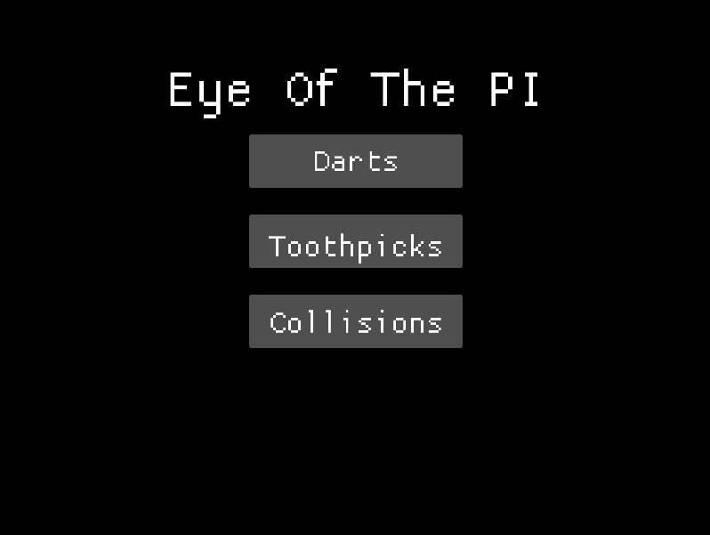
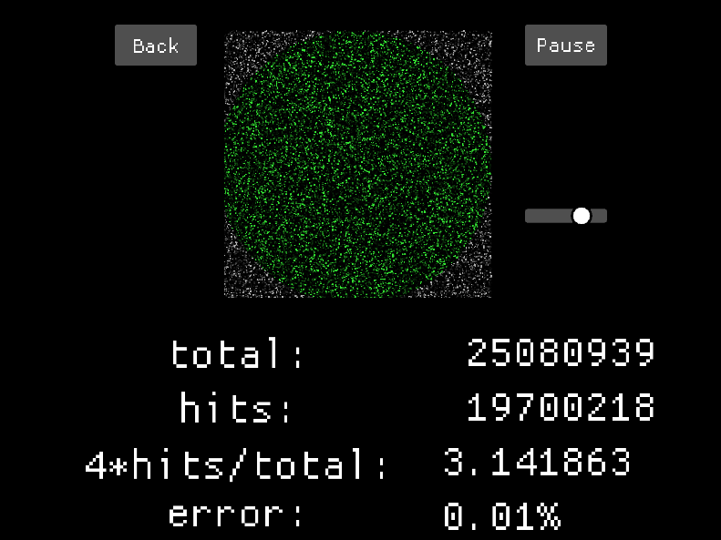
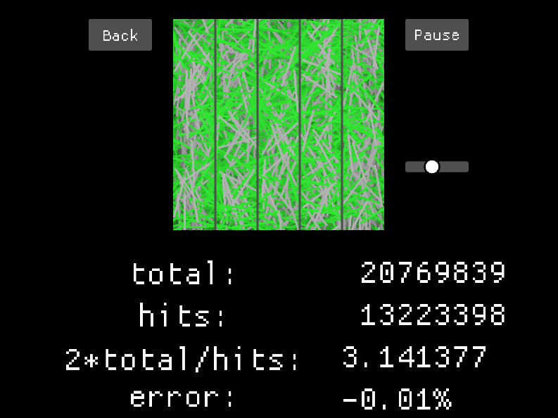
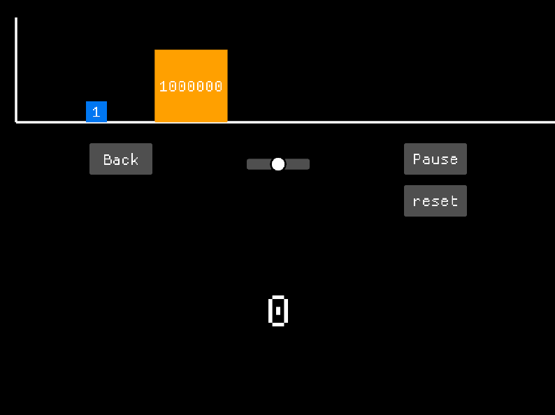
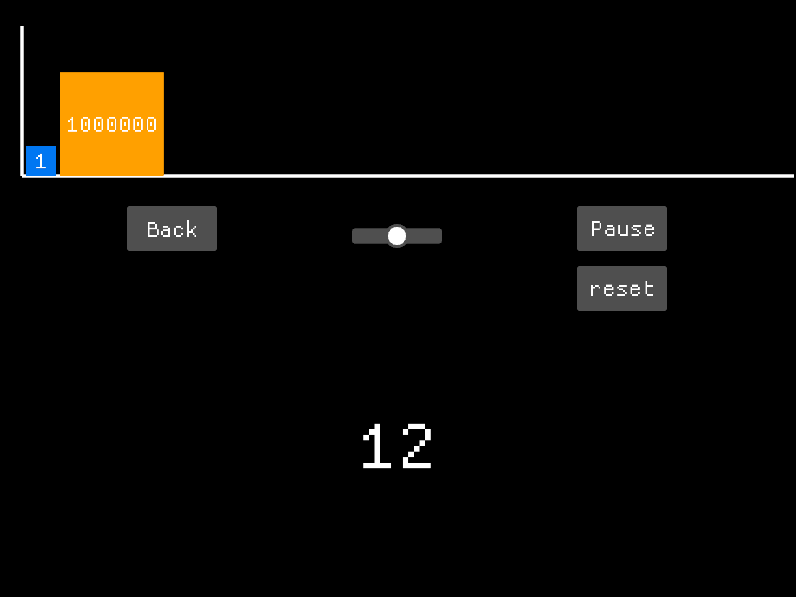
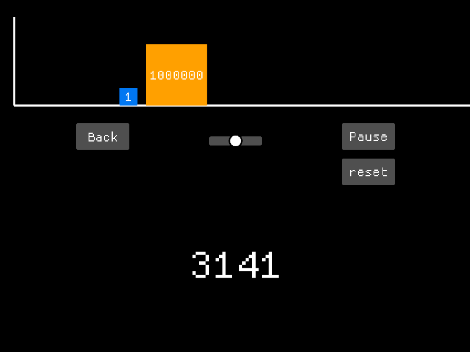

# Pi approximation toy

### The software allows for approximating pi in three ways

## 1. Darts - Monte Carlo method
The program throws "darts" at a wall and calculates the ratio between hits and all throws. 

## 2. Toothpicks
The program scatters "toothpicks" on the ground and calculates the ratio between those intersecting panel borders and all throws.

## 3. Collisions
The program throws a block at another and counts the collisions.

 
 
 

All those simulations allow for some control.